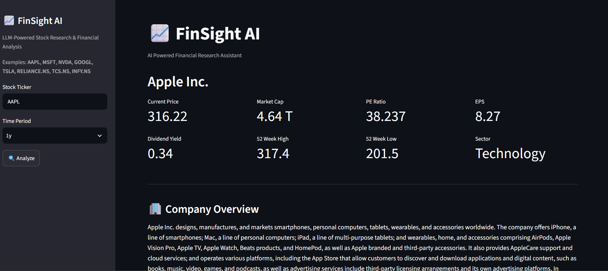
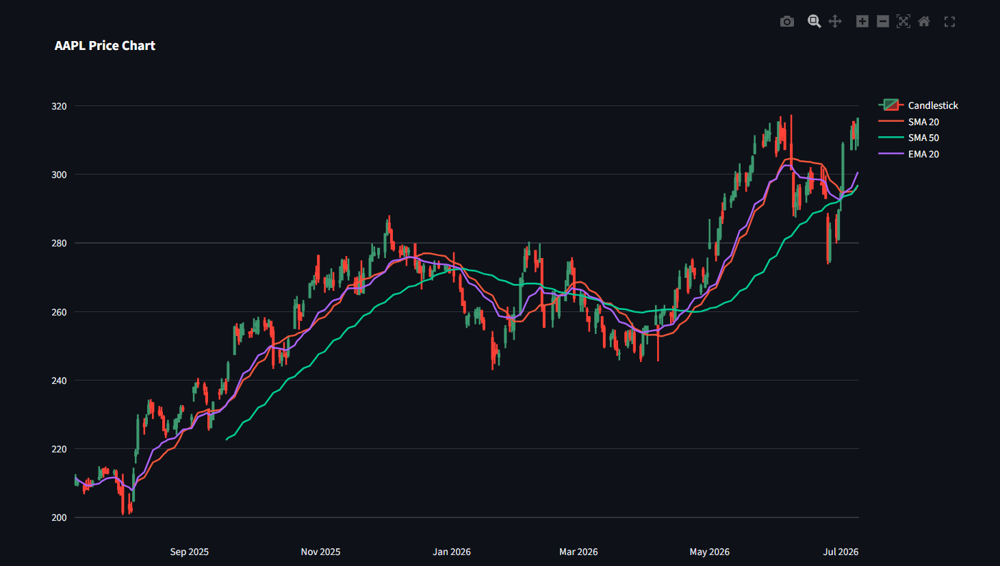
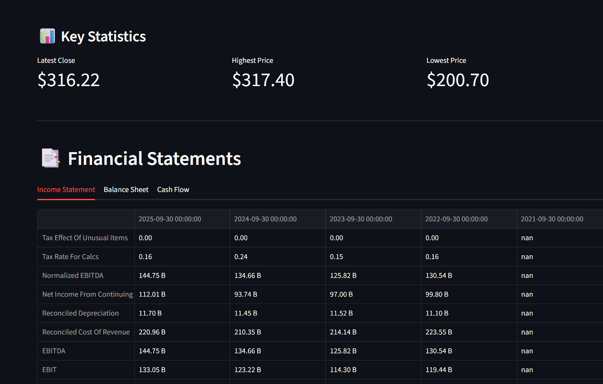
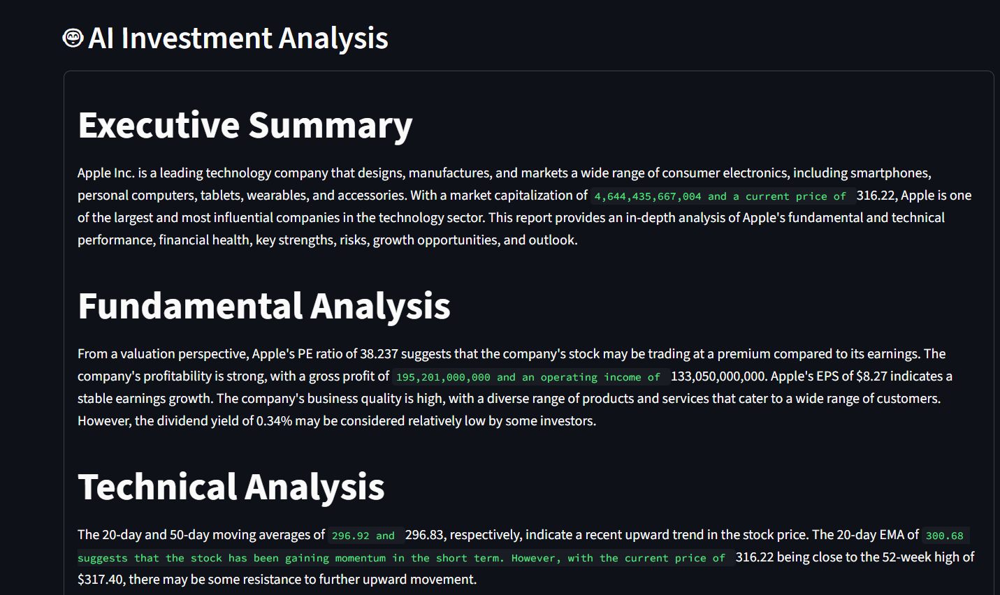

# 📈 FinSight AI

An AI-powered financial research assistant that combines **live market data**, **technical analysis**, **financial statements**, and **Large Language Models (LLMs)** to generate professional equity research reports.

---

## 🚀 Live Demo

🔗 **https://finsight-ai-s6sse6jrgibzxblvyc5g54.streamlit.app/**

---

## ✨ Features

- 📊 Live Stock Market Data
- 📈 Interactive Stock Price Visualization
- 📉 Technical Indicators
  - SMA 20
  - SMA 50
  - EMA 20
- 📑 Income Statement
- 🏦 Balance Sheet
- 💵 Cash Flow Statement
- 🤖 AI-Powered Investment Analysis using Llama 3.3
- 📱 Responsive Streamlit Dashboard
- ☁️ Cloud Deployment on Streamlit

---

## 📷 Application Preview

### Dashboard



---

### Technical Analysis



---

### Financial Statements



---

### AI Investment Analysis



---

## 🛠️ Tech Stack

| Category | Technologies |
|-----------|--------------|
| Language | Python |
| Frontend | Streamlit |
| Data | Pandas |
| Market Data | yFinance |
| Visualization | Plotly |
| AI | Groq API + Llama 3.3 70B |
| Version Control | Git & GitHub |
| Deployment | Streamlit Community Cloud |

---

## ⚙️ Installation

Clone the repository

```bash
git clone https://github.com/ViruS-rep/FinSight-AI.git
```

Go into the project directory

```bash
cd FinSight-AI
```

Install dependencies

```bash
pip install -r requirements.txt
```

Create a `.env` file

```env
GROQ_API_KEY=your_api_key_here
```

Run the application

```bash
streamlit run app.py
```

---

## 📊 What the Application Provides

### Company Overview

- Company Profile
- Market Capitalization
- PE Ratio
- EPS
- Dividend Yield
- Business Summary

### Technical Analysis

- Historical Stock Prices
- SMA 20
- SMA 50
- EMA 20
- Interactive Plotly Charts

### Financial Analysis

- Income Statement
- Balance Sheet
- Cash Flow Statement

### AI Research Report

The integrated LLM generates a professional equity research report including:

- Executive Summary
- Fundamental Analysis
- Technical Analysis
- Financial Health
- Strengths
- Risks
- Growth Opportunities
- Short-Term Outlook
- Long-Term Outlook
- Investment Opinion

---

## 📁 Project Structure

```
FinSight-AI
│
├── assets/
│   ├── dashboard.png
│   ├── chart.png
│   ├── financials.png
│   └── AI-analysis.png
│
├── app.py
├── stock.py
├── llm.py
├── requirements.txt
├── .gitignore
└── README.md
```

---

## 🔮 Future Improvements

- Real-Time Financial News
- Market Sentiment Analysis
- Portfolio Tracker
- Stock Comparison Dashboard
- Risk Score Prediction
- PDF Equity Research Report Export
- Watchlist & Alerts

---

## 👨‍💻 Author

**ViruS-rep**

If you found this project interesting, consider ⭐ starring the repository.
