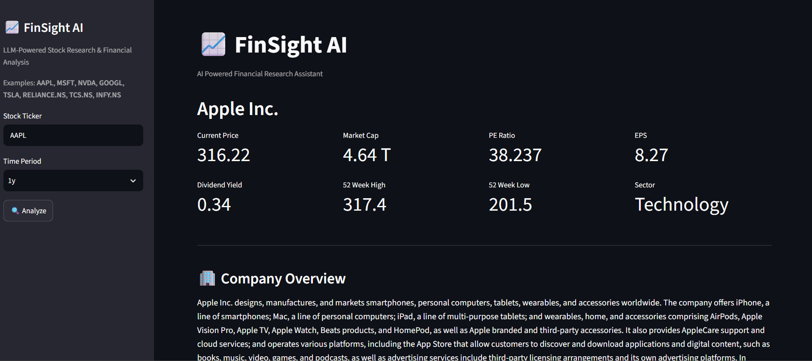
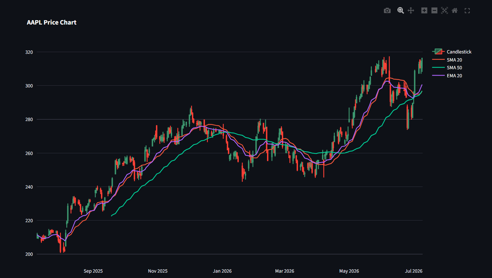
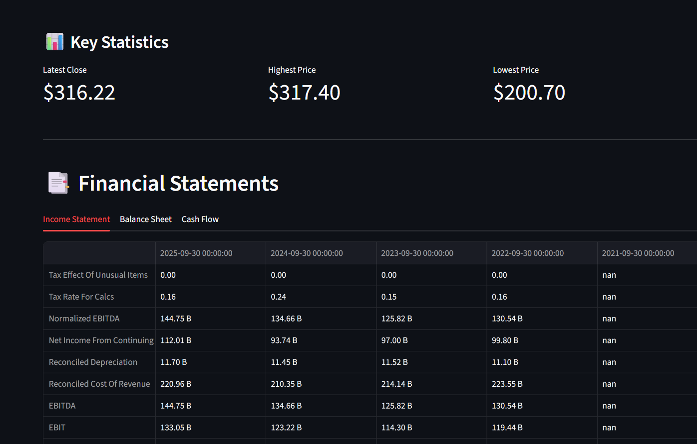
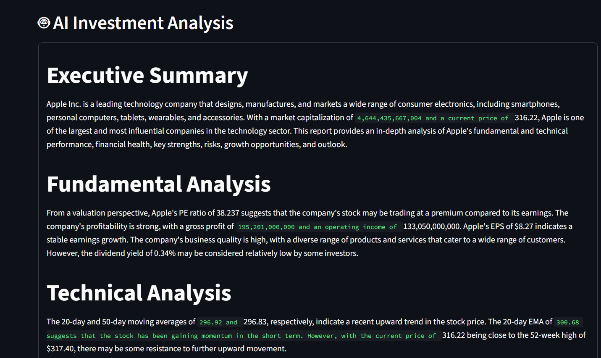

# 📈 FinSight AI

An AI-powered financial research assistant that combines **live market data**, **financial statements**, **technical analysis**, **Retrieval-Augmented Generation (RAG)**, **market sentiment analysis**, and **Llama 3.3** to generate professional equity research reports.

---

# 🚀 Live Demo

🔗 https://finsight-ai-s6sse6jrgibzxblvyc5g54.streamlit.app/

---

# ✨ Features

### 📊 Live Market Intelligence

- Live Stock Prices
- Company Overview
- Market Capitalization
- PE Ratio
- EPS
- Dividend Yield
- Business Summary

### 📈 Technical Analysis

- Interactive Plotly Charts
- SMA 20
- SMA 50
- EMA 20
- Historical Price Analysis

### 📑 Financial Statements

- Income Statement
- Balance Sheet
- Cash Flow Statement

### 🧠 AI Research Engine

- Llama 3.3 powered investment analysis
- Retrieval-Augmented Generation (RAG)
- Semantic search over a financial knowledge base
- Context-aware report generation
- Market sentiment analysis
- Investment recommendations with supporting context

### ⚡ Performance

- Cached knowledge base loading
- Modular service architecture
- Responsive Streamlit interface

---

# 📷 Application Preview

## Dashboard



---

## Technical Analysis



---

## Financial Statements



---

## AI Investment Analysis



---

# 🛠 Tech Stack

| Category | Technologies |
|-----------|--------------|
| Language | Python |
| Frontend | Streamlit |
| Data Processing | Pandas, NumPy |
| Market Data | yFinance |
| Visualization | Plotly |
| LLM | Groq API + Llama 3.3 70B |
| RAG | Sentence Transformers (all-MiniLM-L6-v2) |
| NLP | Semantic Search, Market Sentiment Analysis |
| Environment | python-dotenv |
| Version Control | Git & GitHub |
| Deployment | Streamlit Community Cloud |

---

# 🏗 Architecture

```
                User Query
                     │
                     ▼
              Streamlit Frontend
                     │
      ┌──────────────┼──────────────┐
      ▼              ▼              ▼
 Stock Service   News Service   RAG Service
      │              │              │
      ▼              ▼              ▼
 yFinance API   Market News   Knowledge Base
      │                             │
      └──────────────┬──────────────┘
                     ▼
             Context Builder
                     │
                     ▼
          Groq Llama 3.3 LLM
                     │
                     ▼
     Professional Equity Research Report
```

---

# ⚙️ Installation

Clone the repository

```bash
git clone https://github.com/ViruS-rep/FinSight-AI.git
```

Go to the project

```bash
cd FinSight-AI
```

Create a virtual environment

```bash
python -m venv venv
```

Activate it

### Windows

```bash
venv\Scripts\activate
```

### Linux / macOS

```bash
source venv/bin/activate
```

Install dependencies

```bash
pip install -r requirements.txt
```

Create a `.env` file

```env
GROQ_API_KEY=your_groq_api_key
```

Run the application

```bash
streamlit run app.py
```

---

# 📊 AI Research Report Includes

- Executive Summary
- Company Overview
- Fundamental Analysis
- Technical Analysis
- Financial Health Assessment
- Market Sentiment Analysis
- Strengths
- Risks
- Growth Opportunities
- Short-Term Outlook
- Long-Term Outlook
- Final Investment Recommendation

---

# 📂 Project Structure

```
FinSight-AI
│
├── assets/
│   ├── dashboard.png
│   ├── chart.png
│   ├── financials.png
│   └── AI-analysis.png
│
├── data/
│   └── knowledge_base.json
│
├── services/
│   ├── rag_service.py
│   ├── sentiment_service.py
│
├── app.py
├── stock.py
├── llm.py
├── requirements.txt
├── .gitignore
└── README.md
```

---

# 🔍 How RAG Works

1. User selects a stock.
2. Live financial data is fetched using yFinance.
3. Relevant financial knowledge is retrieved using semantic search.
4. Market sentiment is analyzed.
5. Retrieved context is combined with live financial metrics.
6. Llama 3.3 generates a grounded equity research report.

---

# 🚀 Future Improvements

- SEC Filing Retrieval
- Earnings Call Analysis
- Vector Database (FAISS/ChromaDB)
- Portfolio Optimization
- Multi-Company Comparison
- PDF Equity Research Report Export
- Watchlist & Alerts
- Real-Time News Summarization

---

# 👨‍💻 Author

**Viraj**

GitHub: https://github.com/ViruS-rep

If you found this project useful, consider giving it a ⭐.
